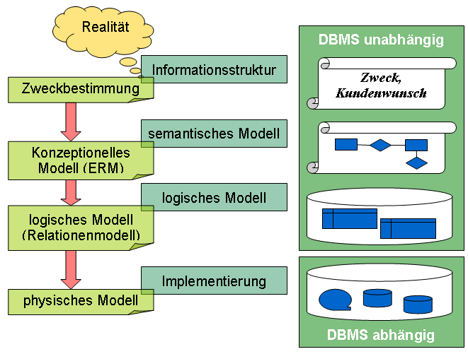
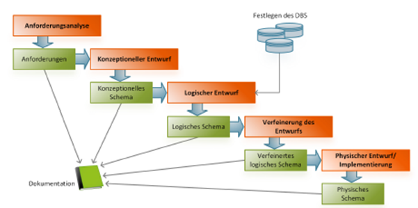
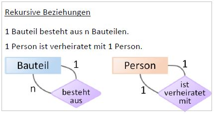
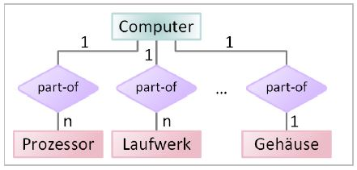
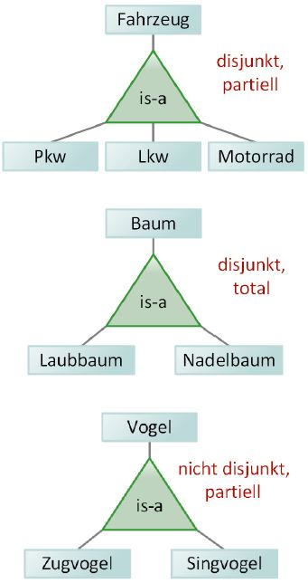
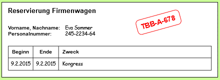
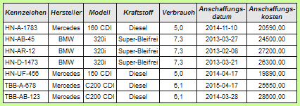
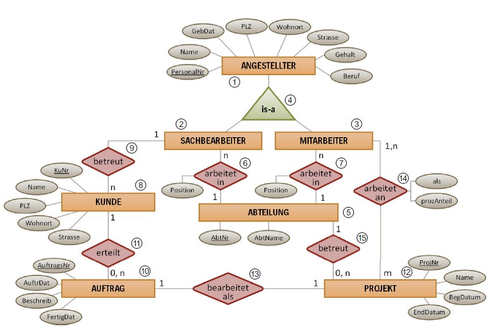
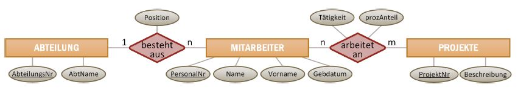
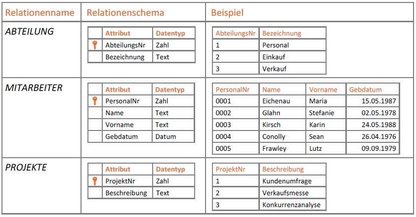

# Datenbanksysteme

Einteilung:
- Hierarchische DBS
- Netzwerk DBS
- Relationale DBS
- Objektorientierte DBS
- Objektrelationale DBS

## Drei-Ebenen-Architektur

Weiter Infos unter: 
[https://luo-darmstadt.de/wiki2/doku.php?id=db:datenbanksysteme](https://luo-darmstadt.de/wiki2/doku.php?id=db:datenbanksysteme)

## Datenbankentwurf

[https://info-wsf.de/datenbankentwurf/](https://info-wsf.de/datenbankentwurf/)

Die 4 Phasen eines Datenbankentwurfs:
- In der **externen Phase** findet eine Zweckbestimmung statt -> Kundenwunsch
- In der **konzeptionellen Phase** erfolgt die formale und strukturierte Beschreibung aller relevanten Objekte und deren Beziehungen untereinander -> **ER-Modell**
- Dieses semantische Modell wird in der **logischen Phase** in ein Relationenmodell (auch **relationales Datenbankmodell**) umgesetzt.
- Erst in der **physischen Phase** wird die Datenbankstruktur mit einem DBMS modelliert.

### Externe Phase

[https://info-wsf.de/informationsstruktur-ermitteln-externe-phase/](https://info-wsf.de/informationsstruktur-ermitteln-externe-phase/)

- **Top-Down** versus **Bottom-Up**-Ansatz
- Ermittlung aufgrund von Realitätsbeobachtungen Erzeugung eines Ausschnitts der realen Welt -> **Miniwelt**
  
  Beispielsweise ist die Schule ein Teil der realen Welt. Unter dem Blickwinkel der Verwaltung von Schülerdaten würde unsere Miniwelt aus den Objekten Schüler, Lehrer, Bücher, Kurse, Noten und deren Beziehungen zueinander bestehen; andere Objekte der Schule, wie Gebäudedaten, Reinigungskosten usw. würden ausgeklammert. Wir bilden deshalb im Hinblick auf die logische Gesamtsicht ein Modell der Miniwelt.
- Ermittlung aufgrund von Benutzersichtanalysen 
  Benutzersichten stellen zum Beispiel Formulare und Berichte dar.
- Ermittlung aufgrund von Datenbestandsanalysen 
  Dieses Verfahren ermöglicht die Integration existierender Datenbestände in ein neues Datenmodell -> **Migration**
- Geschäftsregeln 
  Feststellungen über die Objekte der Miniwelt.

### Konzeptionelle Phase
Wie im Datenbankentwurf ausgeführt, ist es zunächst sinnvoll, ein konzeptionelles Modell des gegebenen Problems zu erstellen.

Dabei lassen sich drei Abstraktionsmechanismen unterscheiden:
- **Klassifikation**
- **Aggregation**
- **Generalisierung oder Spezialisierung**

Um die Modellierung der Realität systematischer gestalten zu können, gibt es verschiedene Standardstrategien. Eine der bekanntesten ist das so genannte Entity-Relationship-Modell (ER-Modell). Neben dem ER-Modell gibt es weitere Datenbankmodelle, z.B. das Hierarchische Modell (HM), das Netzwerkmodell (NWM), das Relationenmodell (RM), das SQL-Datenmodell (SQL) oder das Normalformmodell (NFM).

Abstraktionskonzepte: 
Bei der Erstellung eines Datenmodells werden die Objekte und deren Eigenschaften untersucht. Es werden zuerst alle Daten (Objekte) gesammelt. In einem Prozess der Abstraktion werden dann gleichartige Mengen von Objekten zusammengefasst und auf relevante Eigenschaften untersucht. In der Informatik existieren bestimmte Konzepte, nach denen dieser Abstraktionsprozess erfolgt.

#### Klassifikation

Gleichartige Dinge (Objekte) mit gemeinsamen Eigenschaften werden zu Klassen zusammengefasst.

#### Aggregation

Eine neue Klasse wird aus anderen, bereits existierenden Klassen zusammengesetzt bzw. besteht zum Teil aus Objekten anderer Klassen.

#### Generalisierung (Verallgemeinerung)

Zwischen bestimmten Klassen wird eine Teilmengenbeziehung hergestellt. Dabei stellt eine Klasse eine Verallgemeinerung der anderen Klasse dar. Zum Beispiel ist die Klasse Tier eine Verallgemeinerung der Klassen Vögel, Reptilien und Säugetiere. Die Eigenschaften der verallgemeinerten Klasse werden den Klassen vererbt, die Teilmengen dieser Klasse sind.

#### Assoziation

Objekte bzw. Klassen können miteinander in Beziehung gesetzt (assoziiert) werden. Diese Beziehung kann zwischen zwei oder mehr Objekten aufgebaut werden.

#### Identifikation

Eigenschaftswerte bzw. Kombinationen von Eigenschaftswerten der Objekte werden als Schlüssel definiert und dienen der eindeutigen Identifizierung des Objekts. Über diese Schlüssel werden die Objekte assoziiert.

#### Beziehungen

 - **Beziehungen**: Durch Beziehungen werden die Wechselwirkungen oder Abhängigkeiten von Entitäten ausgedrückt. Beziehungen können Eigenschaften besitzen.
 - **Beziehungsmenge**: Eine Beziehungsmenge (Assoziation) ist eine Sammlung von Beziehungen gleicher Art zur Verknüpfung von Entitätsmengen (Tabellen).
 - **Beziehungstyp**: Ein Beziehungstyp ist, analog zum Entity-Typ, die Abstraktion gleichartiger Beziehungen.

Beziehungsgrade: 
- **Binär**, wenn genau zwei Entities miteinander verbunden sind
- **Ternär**, wenn genau drei Entities miteinander verbunden sind
- **n-är**, wenn mehrere, d. h. genau n Entities miteinander verbunden sind
- **Rekursiv unär**, wenn ein Entity mit sich selbst in Beziehung steht

Spezielle Beziehungsformen: 
- **Rekursive Beziehungen** entstehen, wenn ein Entity-Typ eine Assoziation auf sich selbst besitzt (rekursiv unäre Beziehung). 
  
- Das Konzept der **Aggregation** wird durch eine **Part-of-Beziehung** (Ist-Teil-von-Beziehung) ausgedrückt (n-äre Beziehung). 
  
- Is-a-Beziehungen drücken eine Generalisierung (Verallgemeinerung) oder Spezialisierung aus, d. h., sie stellen eine Teilmengenbeziehung dar 
  

#### Kardinalität

- [https://michael-fuchs-sql.netlify.app/2021/03/03/entity-relationship-diagram-erd/](https://michael-fuchs-sql.netlify.app/2021/03/03/entity-relationship-diagram-erd/)
- [https://michael-fuchs-sql.netlify.app/](https://michael-fuchs-sql.netlify.app/)

### Beispiele der konzeptionellen Phase

#### Galerie

- Eine Galerie kann eindeutig über ihren Namen identifiziert werden, und sie besitzt eine Adresse.
- Eine Galerie präsentiert Ausstellungen, die durch die Angaben ihres Titels eindeutig identifizierbar sind. Außerdem müssen ihr Anfangs- und Enddatum festgehalten werden.
- Eine Ausstellung setzt sich aus mehreren Kunstgegenständen zusammen, die durch eine global eindeutige Registriernummer identifizierbar sind und eine Bezeichnung haben.
- Außerdem soll die Art der Kunstgegenstände gespeichert werden, die entweder „Gemälde“ oder „Skulptur“ (nichts anderes) sein kann.
- Der Name des Künstlers sowie das Jahr der Erschaffung müssen erfasst werden.
- Der Künstler kann in einer Ausstellung mehrere Kunstgegenstände präsentieren.
- Eine Galerie muss (im gesamten erfassten Zeitraum) mindestens eine Ausstellung präsentieren. Eine Ausstellung findet in genau einer Galerie statt.
- Ein Kunstgegenstand ist (im Laufe der Zeit) Bestandteil von beliebig vielen (oder keiner) Ausstellung(en). Eine Ausstellung besteht aus mindestens 5 Kunstgegenstände.

#### Fuhrpark

Die Firma Atlanta GmbH hat einen Fuhrpark von Firmenwägen, die von Mitarbeitern für berufliche Zwecke genutzt werden können. Das Unternehmen möchte die Verwaltung des Fuhrparks, die bislang ausschließlich in Papierform erfolgt, auf eine IT-gestützte Lösung umstellen.

Erstellen Sie aufgrund der folgenden Unterlagen und Anforderungen ein Entity-Relationship-Diagramm.
- Reservierung 
  Mitarbeiter füllen einen Reservierungsvordruck aus. Ein Verantwortlicher des Fuhrparks ordnet der Reservierung dann ein Fahrzeug zu und vermerkt dessen Kennzeichen auf dem Reservierungsvordruck.
  
  
  
  Wird ein neues Fahrzeug angeschafft, erfasst die Fuhrparkverwaltung dessen Daten in folgender Tabelle.
  
  
  
- Instandhaltung 
  Bei Reparaturen beziehungsweise Wartungsarbeiten an Fahrzeugen sollen Datum, Kilometerstand, Kosten sowie eine kurze Beschreibung in der Datenbank festgehalten werden.
- KFZ-Versicherung 
  Als zusätzliche Anforderung sollen auch einige Daten der Kfz-Versicherungen der Fahrzeuge in die Datenbank integriert werden.
  Verlangt werden jeweils folgende Informationen: die Versicherungsnummer, ob zusätzlich zur Haftpflichtversicherung eine Vollkasko bzw. Teilkasko abgeschlossen wurde, die Höhe des jährlichen Beitrags sowie der Firmenname der jeweiligen Versicherungsgesellschaft, inklusive Postanschrift und Telefonnummer. 
  Es soll auch möglich sein, die Kontaktdaten einer Versicherungsgesellschaft zu erfassen, mit der bisher noch kein Kfz-Versicherungsvertrag abgeschlossen worden ist. 
  Es reicht aus, wenn für jeden Firmenwagen jeweils der aktuelle Vertrag gespeichert werden kann. Eine Historie wird nicht verlangt.

#### Kunden- und Projektverwaltung

#### Baufirma
Erstellen Sie ein ER-Modell für den folgenden Sachverhalt: Eine Baufirma möchte eine Datenbankanwendung einsetzen, um die Kundenaufträge und vorhandenen Ressourcen (Lager, Fahrzeuge, Fahrer) besser planen zu können. 
In der Firma sind Büroangestellte, Fahrer, Arbeiter und Techniker angestellt. 
Die Büroangestellten betreuen die Kunden und nehmen die Aufträge der Kunden entgegen. 
Die Arbeiter und Fahrer führen die Aufträge aus. Der Fahrer benutzt dazu einen Lieferwagen oder einen Lkw. Für einen Auftrag werden ein Fahrer und ein oder mehrere Arbeiter benötigt. Für einige Aufträge werden Materialien aus dem Lager benötigt. 
Der Techniker betreut den Fuhrpark, zu dem die Lieferwagen und Lkws gehören. 
Versehen Sie die Entity-Typen des ER-Modells mit Attributen, die Sie für notwendig halten, und legen Sie auch Primärschlüssel fest. Beschriften Sie die Beziehungen und geben Sie die Kardinalitäten an.

#### Lehrveranstaltungen
Die Planung der Lehrveranstaltungen für Lehrer, Klassen und Räume soll in einem ER-Modell dargestellt werden. Zu beachten ist dabei, dass nicht jeder Unterricht in jedem beliebigen Raum abgehalten werden kann (z. B. Computer-Unterricht nur in Räumen, in denen sich
Computer befinden). Alle Angehörigen der Bildungseinrichtung und die Zugehörigkeit zu den Abteilungen bzw. Klassen sind ebenfalls in das Modell zu integrieren. Die Lehrer bieten zu bestimmten Fächern Zusatzkurse an, die von einer bestimmten Anzahl an Schülern besucht werden können. Nehmen Sie auch diesen Aspekt mit in das Modell auf.

### Relationales Modell
Das relationale Datenmodell wurde 1970 von dem Mathematiker E. F. Codd entwickelt und mithilfe der Mengentheorie beschrieben. Dieses Modell bildet die Basis für relationale Datenbanken.

#### Relation
Eine Relation ist im Sinne einer relationalen Datenbank eine Menge von Tupeln (Datensätzen). Sie hat die Form einer Tabelle und ist damit eine Konstruktion aus Spalten und Zeilen. Sowohl Entitäten als auch Beziehungen des Entity-Relationship-Modells werden als Relationen modelliert.

Eine Relation ist gekennzeichnet durch …
- einen eindeutigen Namen, beispielsweise: Kunde,
- mehrere Attribute (Spalten),
- keine bis beliebig viele Tupel (Tabellenzeilen oder Datensätze),
- einen einzigen Wert pro Attribut in einem Tupel (Tabellenzelle),
- einen Primärschlüssel, bestehend aus einem oder mehreren Attributen
- Dieser identifiziert jedes Tupel eindeutig
- Dessen Wert ändert sich während der Existenz des Datensatzes nicht

### Transformation des ER-Modells in ein relationales Modell
Das folgende ER-Modell soll in ein relationales Modell überführt werden.

#### Entitätsmengen
Für jede Entitätsmenge wird eine Relation erstellt, welche für jedes Attribut eine Spalte besitzt.
Die Primärschlüssel werden übernommen

#### 1:1- und 1:n-Beziehungen
2 Möglichkeiten:

- Es wird eine neue Relation erzeugt, welche als Attribute (Spalten) die Primärschlüssel der beiden Relationen, die in Beziehung stehen, enthält. Außerdem kann die Relation beschreibende Attribute in einer zusätzlichen Spalte aufnehmen. 
Diese Darstellungsform hat den Vorteil, dass keine NULL-Werte auftreten, und den Nachteil, dass eine weitere Relation benötigt wird.
- Eine der beiden Relationen wird um ein Attribut (Spalte) erweitert. Bei 1:1-Beziehungen ist es egal, welche der beiden Relationen erweitert wird. In einer 1:n-Beziehung wird die Relation erweitert, bei der das n steht. (Würde das Attribut an die Relation angefügt
werden, bei der die 1 steht, würden Redundanzen auftreten, die Sie unbedingt vermeiden sollten.) Besitzt die Relation beschreibende Attribute, so werden diese zusätzlich noch bei der erweiterten Relation angegeben.
Bei dieser Darstellungsform können NULL-Werte auftreten. Sie hat aber den Vorteil, dass keine zusätzliche Relation benötigt wird. Für das obige Beispiel bedeutet dies, dass die Relation MITARBEITER erweitert wird.

