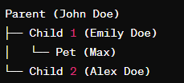
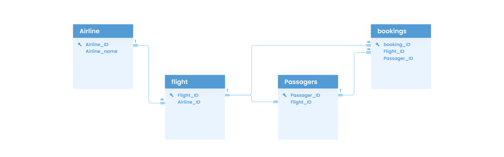
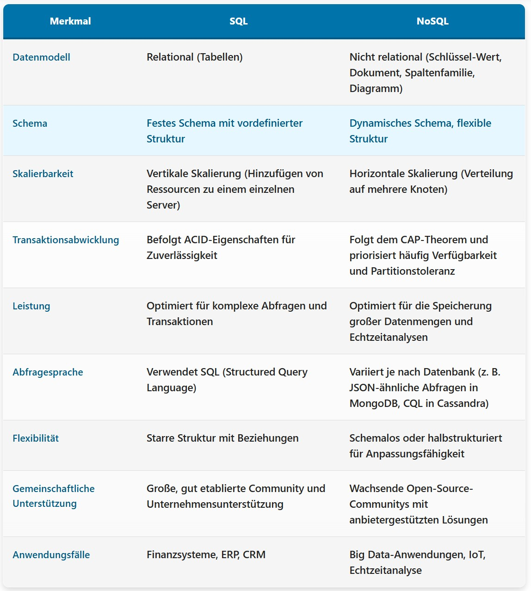
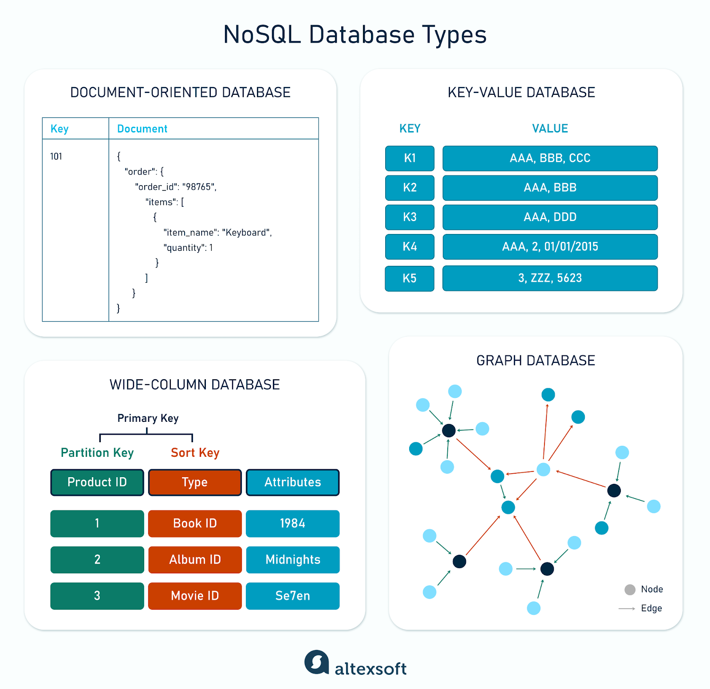
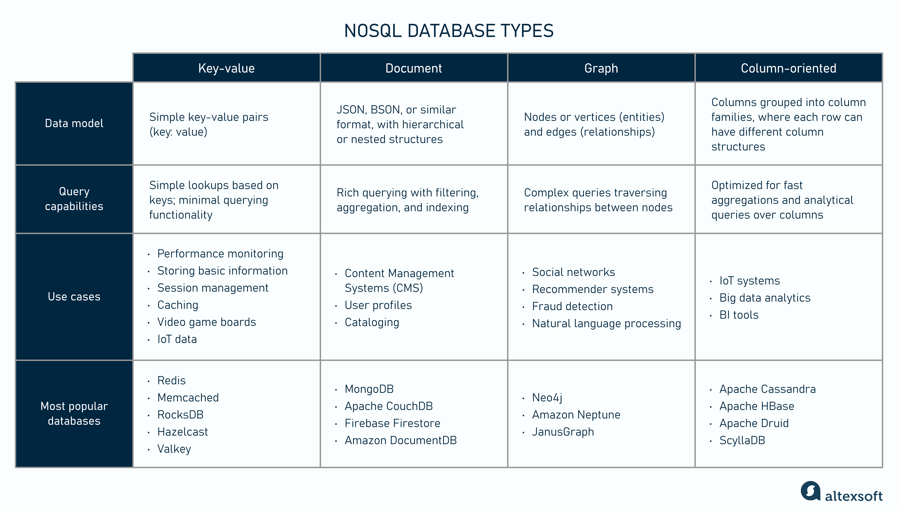
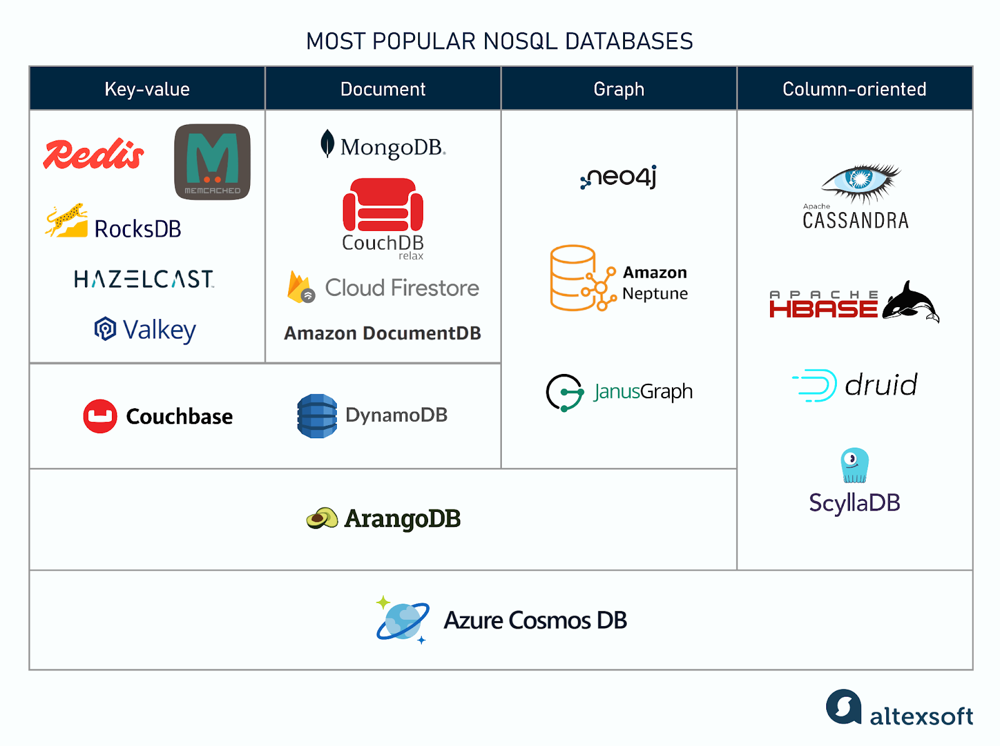
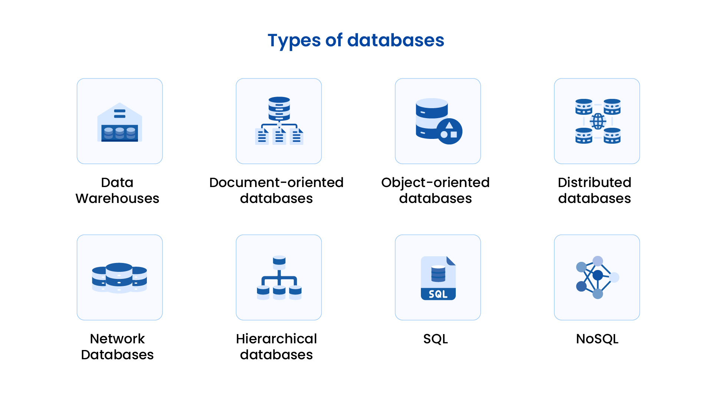
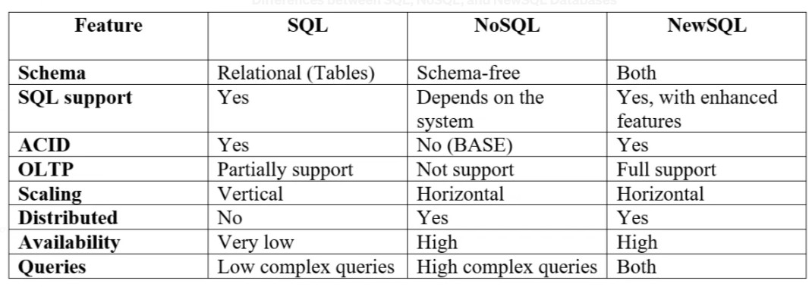

# Verschiedene Arten von Datenbanken

Datenbanken sind für fast alle modernen Anwendungen unverzichtbar und ihre Zahl nimmt ständig zu.
Vereinfacht ausgedrückt ist eine Datenbank eine organisierte Datensammlung, die eine effiziente Speicherung,
Abfrage und Verwaltung von Informationen ermöglicht. Unternehmen verwenden unterschiedliche Datenbanktypen,
um ihre individuellen Geschäftsanforderungen zu erfüllen.

## Verschiedene Arten von Datenbanken?

Datenbanken können je nach Verwendung, Struktur und Speichermethoden in verschiedene Typen eingeteilt werden. Die wichtigste Klassifizierung betrifft die Art des Datenmodells, wonach es drei Haupttypen von Datenbanken gibt: **relational, hierarchische und Netzwerk**.

- Hierarchische Datenbanken
- Relationale oder SQL-Datenbanken
- Nicht-relationale oder NoSQL-Datenbanken
- Objektorientierte Datenbanken
- Netzwerkdatenbanken
- Objektrelationale-DB, Vektordatenbanken, BigData, NewSQL-DB, ...

### Hierarchische Datenbanken

Wie der Name schon sagt, ähnelt eine hierarchische Datenbank sehr einem Stammbaum. Dieser in den 1960er Jahren entwickelte Typ strukturiert Daten mithilfe einer Eltern-Kind-Beziehung. Das bedeutet, dass jeder übergeordnete Datensatz einen oder mehrere untergeordnete Datensätze hat, aber jeder untergeordnete Datensatz nur mit einem übergeordneten Datensatz verknüpft ist.

**Beispiele:** Windows-Registrierung, IBM Information Management System (IMS), Navigationsdateien, Sitemaps, XML, XAML usw.

**Vorteile:**
- Schneller und effizienter Datenabruf.
- Vorhersehbare Datenbankstruktur.
- Einfaches Hinzufügen und Löschen von Informationen.

**Nachteile:**
- Starre Eltern-Kind-Beziehungen machen es unflexibel für komplexe Datenstrukturen wie Viele-zu-viele-Beziehungen.
- Schwieriger zu skalieren und die Struktur lässt sich nur schwer ändern, was ihre Anwendungsmöglichkeiten begrenzt.

### Relationale oder SQL-Datenbanken

Relationale Datenbanken wurden in den 1970er Jahren entwickelt und gelten heute als der ausgereifteste Datenbanktyp. In relationalen Datenbanken werden Daten in Form diskreter Tabellen mit eindeutigen Datenfeldern gespeichert, die über einen Primärschlüssel identifizierbar sind.

Diese Tabellen können auch über Fremdschlüssel miteinander verknüpft sein, d. h. sie sind miteinander verknüpft. So kann beispielsweise eine Tabelle mit Kundeninformationen mit einer anderen Tabelle verknüpft sein, die die Kaufhistorie der einzelnen Kunden enthält.

[Weitere Infos](https://www.astera.com/de/type/blog/relational-database-management-system/)

Benutzer können mit den Daten über einfache Abfragen (SQL) interagieren und Vorgänge wie das Erstellen, Lesen, Aktualisieren und Löschen (CRUD) von Datenfeldern durchführen. Aus diesem Grund werden diese Datenbanken auch informell als SQL-Datenbanken bezeichnet.

**Beispiele:** Zu den bekanntesten Beispielen relationaler Datenbanken zählen MySQL, Microsoft SQL Server und Oracle.

**Vorteile:**
- Relationale Datenbanken gewährleisten die Datenintegrität durch die Aufrechterhaltung der Beziehungen zwischen verschiedenen Tabellen.
- Dank des benutzerfreundlichen Tabellenformats sind sie einfach zu verwenden.
- Einfache Abfragen, unterstützt aber auch Abfragen für komplexe Datenbanken.

**Nachteile:**
- Aufgrund der eingeschränkten Skalierbarkeit und Schemastarrheit sind sie weniger flexibel.
- Möglicherweise nicht für größere Datensätze oder hohe Lese-/Schreiblasten geeignet.

### Nicht-relationale oder NoSQL-Datenbanken

Eine nicht-relationale oder NoSQL-Datenbank wird häufig als Oberbegriff für alle Datenbanken verwendet, die nicht auf einem relationalen Modell basieren. NoSQL-Datenbanken sind in den Vordergrund gerückt, weil Webanwendungen zunehmend komplexer wurden und nicht auf tabellenbasierten relationalen Modellen basieren konnten.

Vor diesem Hintergrund basieren nicht-relationale Datenbanken auf flexiblen Modellen wie Spaltenfamilien, Schlüssel-Wert-Paaren, Dokumenten oder Diagrammen, um strukturierte, unstrukturierte oder halbstrukturierte Daten zu verarbeiten.

**Vorteile:**
- Ihre schemafreie Natur erleichtert die Verwaltung und Speicherung großer Datenmengen. Sie können auch problemlos horizontal skaliert werden.
- Die Daten sind nicht zu komplex und können zur besseren Zugänglichkeit auf mehrere verschiedene Knoten verteilt werden.

**Nachteile:**
- Da sie keine spezifische Struktur oder kein spezifisches Schema für die gespeicherten Daten haben, können Sie sich nicht auf Ihre Daten für ein bestimmtes Feld verlassen, da diese möglicherweise nicht vorhanden sind.
- Wenn keine Beziehungen vorhanden sind, ist die Aktualisierung der Daten schwierig, da Sie jedes Detail einzeln aktualisieren müssen.

#### Arten von NoSQL-Datenbanken

[Weitere Infos](https://www.altexsoft.com/blog/nosql-databases/)

1. **Dokumentdatenbanken** 
   Dokumentdatenbanken speichern Daten in **XML** or **JSON** Dokumente in diesen Datenbanken können verschachtelt werden (ein Dokument kann in einem anderen gespeichert werden) und bestimmte Elemente können auch indiziert werden, um eine schnellere Abfrage zu ermöglichen. Einige der bekanntesten NoSQL-Datenbanken sind Couchbase mit einem MongoDB, fallen in diese Kategorie. 
   Vorteile:
   - Flexibel, da kein festes Schema erforderlich ist
   - Gute Performance
  
   Nachteile:
   - Weniger effizient bei normalisierten Daten
   - Query-Sprache kann ungewohnt sein
  
   Anwendungsfälle:
   - Content-Management-Systeme
   - E-Commerce-Produkte

2. **Spaltenorientierte Datenbanken** 
   Im Gegensatz zu relationalen Datenbanken, die Daten in Zeilen speichern, sind spaltenorientierte Datenbanken als eine Sammlung von Spalten organisiert. Diese Datenbanken sind hilfreich für die Durchführung von Analysen, da nur eine kleine Anzahl von Spalten direkt gelesen werden kann. Jede dieser Spalten kann als Datensatz fungieren, was bei der Skalierung von Petabyte an Daten hilft. Häufig verwendete Beispiele sind Scylla, HBase und Kassandra

   Vorteile:
   - Gut für große Datenmengen
   - Hohe Verfügbarkeit und Fehlertoleranz
  
   Nachteile:
   - Komplex im Vergleich zu Key-Value und Dokumentenspeicher
   - Nicht ideal für Echtzeit-Anwendungen
  
   Anwendungsfälle:
   - Big Data
   - Finanzanwendungen
   
4. **Graphdatenbanken** 
   Graphdatenbanken zeigen die Verbindungen zwischen verschiedenen Datenpunkten. Sie werden verwendet, um verschiedene Datentypen und ihre Beziehungen zueinander zu analysieren. Graphdatenbanken werden als Netzwerk verwandter Objekte oder Knoten dargestellt. Beispiele sind Datastax Enterprise Graph mit einem Neo4J.

   Vorteile:
   - Einfache, verständliche Darstellung
  
   Nachteile:
   - Schwierigere Skalierung als andere NoSQL-Typen
   - Nicht optimal für stark strukturierte Daten 
  
   Anwendungsfälle:
   - Social networks

6. **Schlüssel-Wert-Speicher (Key-Value-DB)** 
   Dieser DB-Typ speichert und liefert nur schnelles und unkompliziertes Wissen über Schlüssel-Wert-Paare. Dies ist eine einfache und unkomplizierte Möglichkeit, die Daten zu speichern und darauf zuzugreifen. Einige beliebte Beispiele sind Amazon DynamoDB mit einem Redis.

   Vorteile:
   - Hohe Performance
   - Einfacher Aufbau
  
   Nachteile:
   - Keine komplexen Abfragen
   - Schwierig zu analysieren
  
   Anwendungsfälle:
   - Caching-Systeme
   - Sitzungsverwaltung

### Objektorientierte Datenbanken

In einer objektorientierten Datenbank speichert das System Informationen objektähnlich und basiert auf den Prinzipien der objektorientierten Programmierung. Diese Objekte enthalten Attribute (also die Daten) und Methoden (also die Funktionen), wodurch sie leicht referenziert und bearbeitet werden können.

Beispielsweise kann ein „Kunde“-Objekt in der Datenbank Attribute enthalten wie Name mit einem Lieferadresse.

**Beispiele:** Einige beliebte Beispiele sind ObjektDB, Db4o, Datenbank, Oracle-Datenbank und IBM DB2.

**Vorteile:**
- Komplexe Datenbeziehungen können natürlich dargestellt werden
- Komplexe Datenstrukturen werden effizient verarbeitet
- Verbesserte Entwicklungsgeschwindigkeit und -freundlichkeit für objektorientierte Anwendungen.
  
**Nachteile:**
- Mögliche Leistungsprobleme bei einfacheren Datensätzen
- Implementierungs- und Wartungskomplexität
- Begrenzte Akzeptanz im Vergleich zu herkömmlichen relationalen Datenbanken.

### Netzwerkdatenbanken

Die Datenbank ähnelt einer hierarchischen Datenbank, unterscheidet sich jedoch dadurch, dass sie den untergeordneten Datensatz mit verschiedenen übergeordneten Datensätzen verbindet und so bidirektionale Beziehungen ermöglicht.

**Beispiele:** Integrated Data Store (IDS), EDMS von Xerox usw.

**Vorteile:**
- Dieser Datenbanktyp eignet sich für komplexe Frameworks, da er viele-zu-viele-Beziehungen effektiv darstellen kann.
  
**Nachteile:**
- Eine Netzwerkdatenbank hängt stark von ihrer vordefinierten Struktur ab, was Änderungen zeitaufwändig und schwierig macht.

### NewSQL-Datenbanken

[Weitere Infos](https://medium.com/@madushankanipunajith/newsql-databases-%EF%B8%8F-78b50fbae357)

