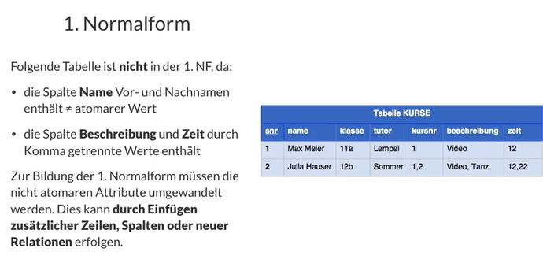
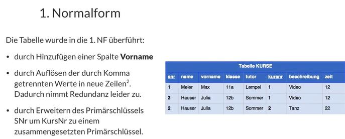
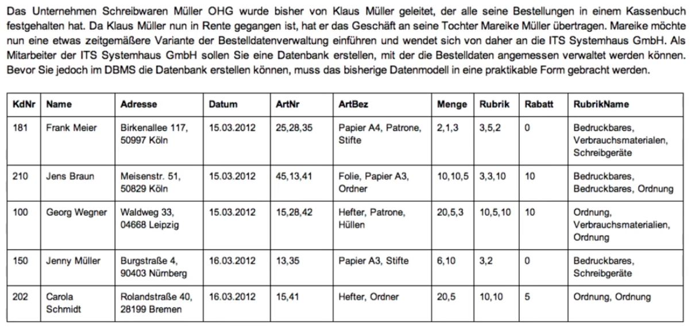

# Datenbanknormalisierung / Normalformen

## Grundlagen

## 1.Normalform

## 2.Normalform

## 3.Normalform

## Gründe der Normalisierung

## Denormalisierung

Hauptsächlich aus Gründen der Performance kann manchmal auch eine Denormalisierung der Tabellen notwendig sein.

## Boyce-Codd-Normalform (BCNF)

[https://de.wikipedia.org/wiki/Normalisierung_(Datenbank)#Boyce-Codd-Normalform_(BCNF)](https://de.wikipedia.org/wiki/Normalisierung_(Datenbank)#Boyce-Codd-Normalform_(BCNF))

## Links

[https://dditools.inf.tu-dresden.de/ovk/Informatik/Datenbanken/Umsetzung/Normalformen.html](https://dditools.inf.tu-dresden.de/ovk/Informatik/Datenbanken/Umsetzung/Normalformen.html)

## Beispiele

