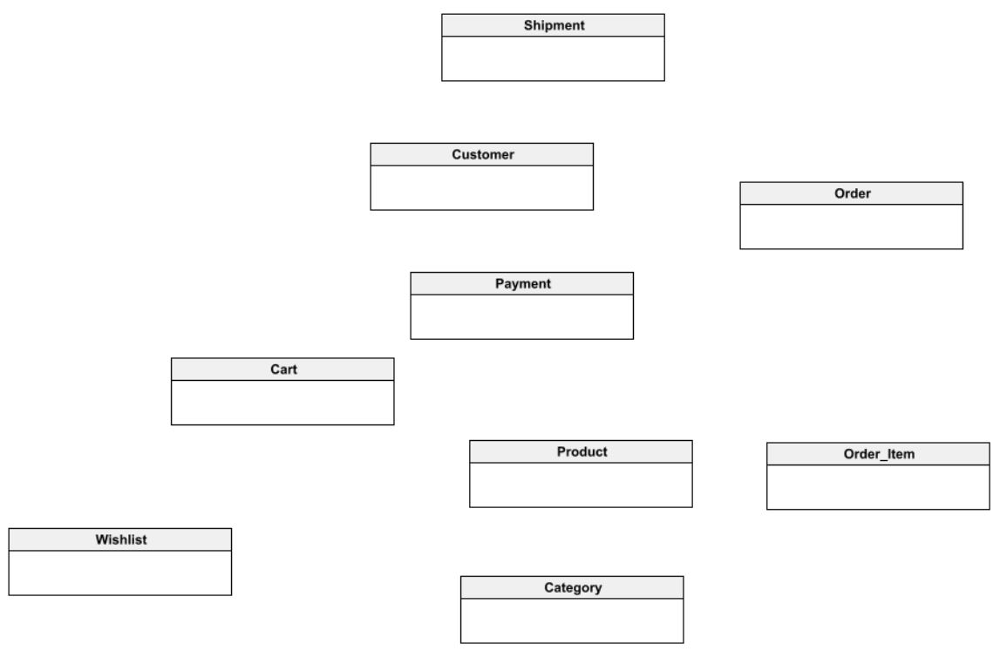

[https://vertabelo.com/blog/er-diagram-for-online-shop/](https://vertabelo.com/blog/er-diagram-for-online-shop/)

## Step 1:

Identify the entities
- **Customer**: This entity represents the customers who create an account to place orders on the online shopping platform.
- **Product**: Represents the set of products available for purchase on the platform.
- **Category**: Categories in which the products are grouped.
- **Order**: Product orders placed by customers.
- **Order_item**: Each item that is part of an order.
- **Payment**: The payment made by the customer once the order is completed.
- **Shipment**: Shipping information associated with an order, including delivery address and tracking information.
- **Cart**: The customer’s virtual basket or shopping cart, which stores items before they are purchased and become part of an order.
- **Wishlist**: Stores items chosen by the customer for possible future purchases.

