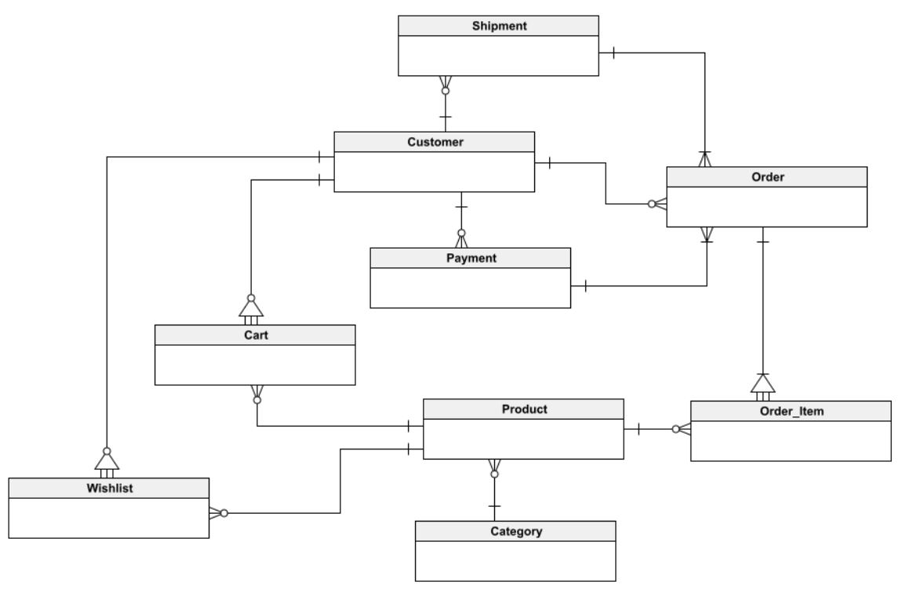
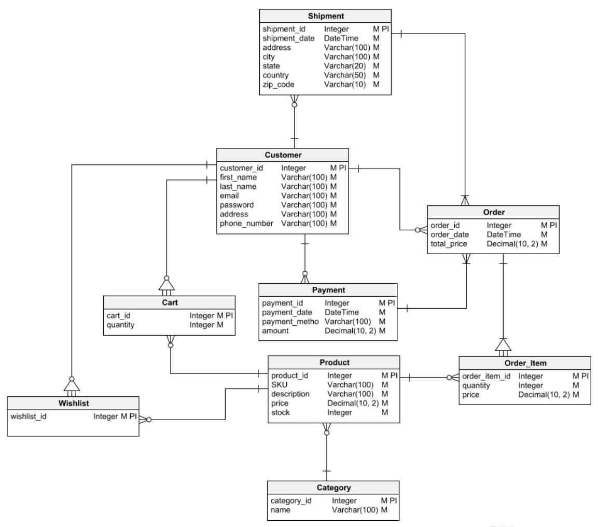
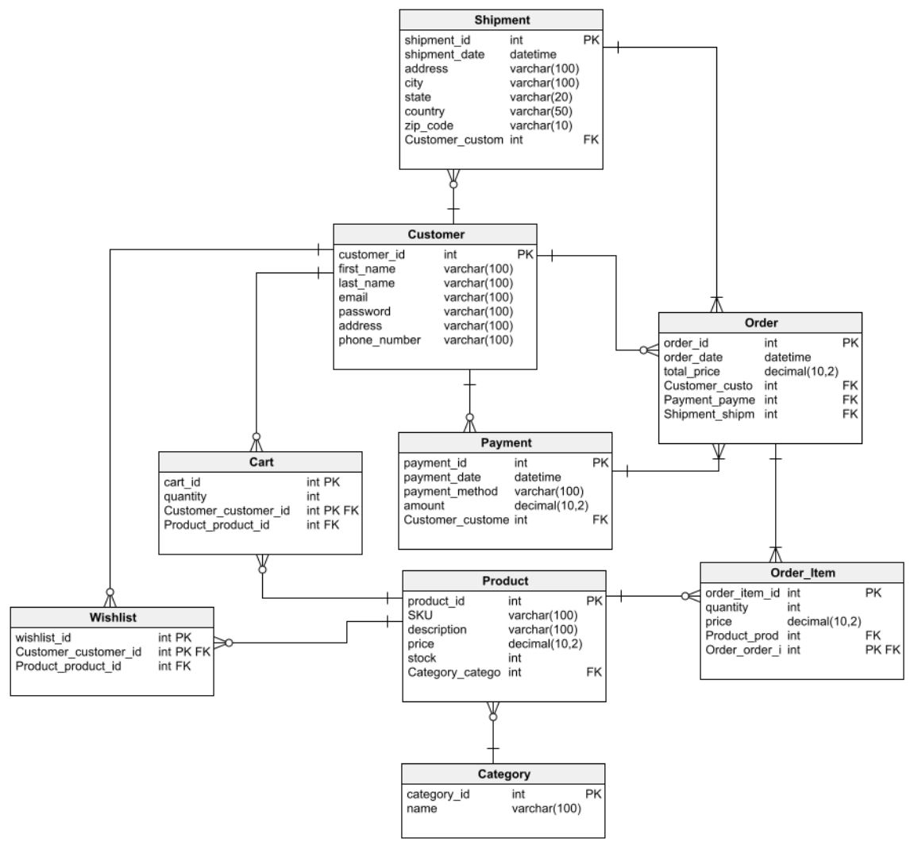

[https://vertabelo.com/blog/er-diagram-for-online-shop/](https://vertabelo.com/blog/er-diagram-for-online-shop/)

## Step 1 - Building a Conceptual Data Model

Identify the **Entities**
- **Customer**: This entity represents the customers who create an account to place orders on the online shopping platform.
- **Product**: Represents the set of products available for purchase on the platform.
- **Category**: Categories in which the products are grouped.
- **Order**: Product orders placed by customers.
- **Order_item**: Each item that is part of an order.
- **Payment**: The payment made by the customer once the order is completed.
- **Shipment**: Shipping information associated with an order, including delivery address and tracking information.
- **Cart**: The customer’s virtual basket or shopping cart, which stores items before they are purchased and become part of an order.
- **Wishlist**: Stores items chosen by the customer for possible future purchases.


Identify the **Relationships between the Entities**
- A customer can place several orders. Therefore, between Customer and Order there must be a one-to-many relationship.
  - **Customer - Order --> one-to-many relationship**
- An order can contain one or several items, each of which represents a single product. Order_Item is a dependent entity of Order, since it has no reason to exist if an order does not exist. In addition, Order_Item is related to Product through a one-to-many relationship: each Order_Item is related to one Product, and a Product can be related to multiple Order_item
  - **Order - Order_item --> one-to-many relationship**
  - **Product - Order_item --> one-to-many relationship**
- An order is associated with one payment and one shipment, but each payment and each shipment can include multiple orders. For this reason, there are one-to-many relationships between Payment and Order and between Shipment and Order.
  - **Payment - Order --> one-to-many relationship**
  - **Shipment - Order --> one-to-many relationship**
- A product can belong to a single category: there is a one-to-many relationship between Product and Category.
  - **Category - Product --> one-to-many relationship**
- The shopping cart and the wish list are dependent entities of Customer, so both Cart and Wishlist maintain a dependency relationship with Customer. In turn, each instance of Cart and of Wishlist is related to a product, so both entities have many-to-one relationships with Product.
  - **Product - Card --> one-to-many relationship**
  - **Product - Wishlist --> one-to-many relationship**
  - **Customer - Card --> one-to-many relationship**
  - **Customer - Wishlist --> one-to-many relationship**



## Step 2 - Build the Logical Model

After identifying the entities that compose it and sketching the conceptual model, we need to define the attributes that compose each entity

**Entity Contruction**

### Customer
- customer_id	integer
- first_name	string
- last_name	string
- email	string
- password	string
- address	string
- phone_number	string

### Cart
- cart_id	integer
- quantity	integer

### Wishlist
- wishlist_id	integer

### Product
- product_id	integer
- SKU	string
- description	string
- price	decimal
- stock	integer

### Category
- category_id	integer
- name	string

### Order
- order_id	integer
- order_date	date/time
- total_price	decimal

### Order_item
- order_item_id	integer
- quantity	integer
- price	decimal

### Payment
- payment_id	integer
- payment_date	date
- payment_method	string
- amount	decimal

### Shipment
- shipment_id	integer
- shipment_date	date
- address	string
- city	string
- state	string
- country	string
- zip_code	string





## Step 3 - Build the Logical Model with PK and FK




## Step 4 - Create sql-script

```sql
-- Table: Cart
CREATE TABLE Cart (
    cart_id int NOT NULL,
    quantity int NOT NULL,
    Customer_customer_id int NOT NULL,
    Product_product_id int NOT NULL,
    CONSTRAINT Cart_pk PRIMARY KEY (cart_id,Customer_customer_id)
);
 
-- Reference: Cart_Customer (table: Cart)
ALTER TABLE Cart ADD CONSTRAINT Cart_Customer FOREIGN KEY Cart_Customer (Customer_customer_id)
REFERENCES Customer (customer_id);
 
-- Reference: Cart_Product (table: Cart)
ALTER TABLE Cart ADD CONSTRAINT Cart_Product FOREIGN KEY Cart_Product (Product_product_id)
REFERENCES Product (product_id);
```
