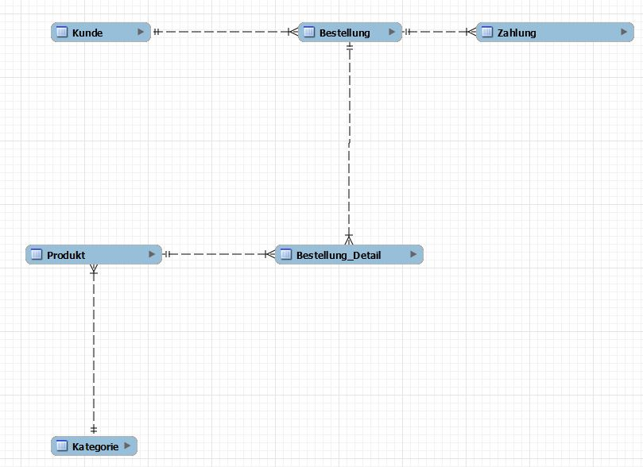

Frage: erstelle mir ein er-diagramm für einen online shop

Ein grundlegendes ER-Diagramm für einen Online-Shop könnte folgende Entitäten (Entities) und deren Beziehungen (Relationships) umfassen:

## Entitäten

- **Kunde** 
  Attribute: KundenID (Primary Key), Name, Email, Passwort, Lieferadresse, Rechnungsadresse, Telefonnummer
- **Produkt** 
  Attribute: ProduktID (Primary Key), Name, Beschreibung, Preis, Lagerbestand, KategorieID (Foreign Key)
- **Kategorie** 
  Attribute: KategorieID (Primary Key), Kategoriename, Beschreibung
- **Bestellung** 
  Attribute: BestellungsID (Primary Key), KundenID (Foreign Key), Bestelldatum, Status, Gesamtpreis
- **BestellungsDetail** 
  Attribute: BestellungsDetailID (Primary Key), BestellungsID (Foreign Key), ProduktID (Foreign Key), Menge, Preis pro Einheit
- **Zahlung** 
  Attribute: ZahlungsID (Primary Key), BestellungsID (Foreign Key), Zahlungsmethode, Zahlungsdatum, Betrag

## Beziehungen

- **Kunde bestellt Bestellung (1 zu N)**: 
  Ein Kunde kann mehrere Bestellungen aufgeben, aber jede Bestellung gehört genau einem Kunden.
- **Bestellung hat BestellungsDetail (1 zu N)**: 
  Eine Bestellung kann mehrere BestellungsDetails haben (welche Produkte und wie viele davon bestellt wurden), aber jedes BestellungsDetail gehört zu genau einer Bestellung.
- **Produkt ist in BestellungsDetail (1 zu N)**: 
  Ein Produkt kann in vielen BestellungsDetails auftauchen (in verschiedenen Bestellungen), aber jedes BestellungsDetail bezieht sich auf genau ein Produkt.
- **Kategorie beinhaltet Produkt (1 zu N)**: 
  Eine Kategorie kann mehrere Produkte enthalten, aber jedes Produkt gehört zu genau einer Kategorie.
- **Bestellung wird bezahlt durch Zahlung (1 zu 1 oder 1 zu N)**: 
  Jede Bestellung hat mindestens eine Zahlungstransaktion. In manchen Fällen könnte eine Bestellung auch in Raten bezahlt werden, was zu mehreren Zahlungseinträgen führen würde.

